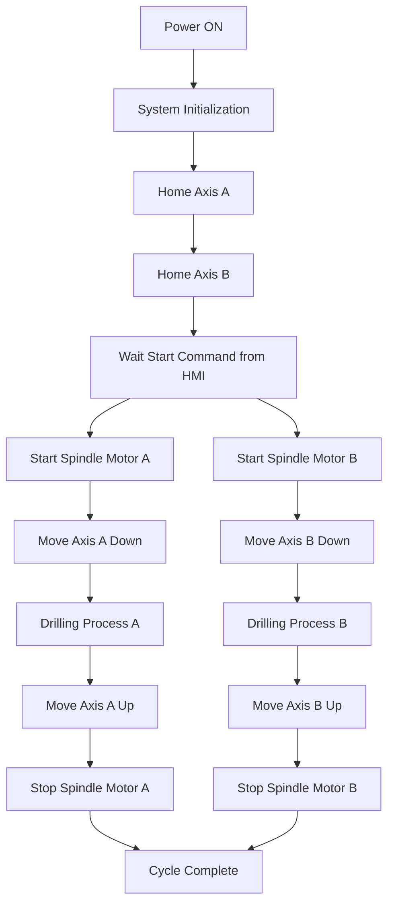

# 🛠️ Drill Servo 2 Axis


Industrial **2-axis drilling control system** built using **Mitsubishi PLC**, **Samkoon HMI**, and **servo motor positioning**.

This project demonstrates a **dual drilling head automation system** where two servo axes control the vertical drilling movement while a spindle motor provides the drilling rotation.

---

# 📌 System Overview

The system controls an **automatic dual-head drilling mechanism** consisting of two servo-driven drilling axes and one spindle motor.

Controlled components:

- **Axis A – Vertical drilling movement for Drill Head A**
- **Axis B – Vertical drilling movement for Drill Head B**
- **Spindle Motor – Provides rotational motion for drilling operation**

The **Samkoon HMI** is used for operator interface and parameter input, while the **Mitsubishi PLC** manages motion sequencing, interlock logic, and drilling cycle control.

---

# ⚙️ Hardware Architecture

```
Operator
   │
   ▼
Samkoon HMI
   │ Communication
   ▼
Mitsubishi PLC
   │
   ├── Servo Drive Axis A
   │       └── Servo Motor A
   |       └── Spindle Motor A
   │
   ├── Servo Drive Axis B
           └── Servo Motor B
           └── Spindle Motor B
```

---

# 🔄 Drilling Process Flow



---

# 📊 Control Features

- Automatic drilling cycle
- Dual servo axis control
- HMI parameter configuration
- Start / Stop / Reset machine control
- Position monitoring
- Safety interlock logic

---

# 🖥️ HMI Functions (Samkoon)

The HMI is used for:

- Machine Start / Stop
- Manual axis control
- Parameter input
- Drilling depth configuration
- Machine status monitoring
- Alarm display

---

# ⚙️ PLC Functions (Mitsubishi)

The PLC is responsible for:

- Servo motion control
- Spindle motor control
- Sequence logic
- Safety interlocks
- Communication with HMI

---

# 🧰 Hardware Used

| Device | Model |
|------|------|
| PLC | Mitsubishi PLC |
| HMI | Samkoon HMI |
| Servo Drive | Mitsubishi / Compatible |
| Servo Motor | 2 Axis (A & B) |
| Spindle Motor | AC Motor |

---

# 🔧 Typical Operation

1. Power ON the machine  
2. System performs axis homing  
3. Operator sets parameters from HMI  
4. Press **Start**  
5. Spindle motor starts  
6. Axis A performs drilling cycle  
7. Axis B performs drilling cycle  
8. Spindle stops  
9. Process finished  

---

# 🚀 Future Improvements

- Multi-hole drilling pattern
- Production counter
- Alarm history logging
- Ethernet monitoring
- Advanced motion control

---

# 🚀 Download

- **Drill Servo 2 Axis Project(Latest)**  
     <br>
  ➡️ [Release Page](https://github.com/viwaretech/drill-servo-2axis/releases/latest)  
   ➡️ [Download Project](https://github.com/viwaretech/drill-servo-2axis/releases/latest/download/drill-servo-2axis.zip)

---

# 📜 License

This project is distributed under a **Commercial License**.

Use of this software requires **purchasing a license from the author**.

📄 Full license terms:

➡ **[LICENSE](LICENSE)**

# 👨‍💻 Author
**HARLEY AD**  
Industrial Automation • PLC Programming • Machine Control Systems
